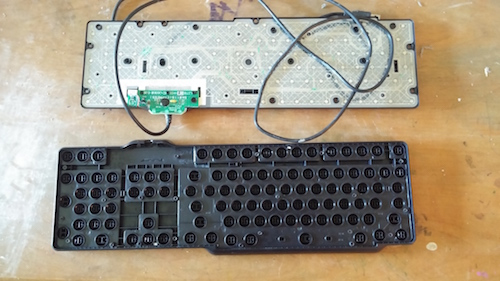

# Dissassemble old electronics

* Age-appropriateness: 2-5 yrs
* Difficulty: Easy

# Goals:

* See which parts are mechanical and which parts are electronic (circuits)
* Explain the purpose of the object and how the different parts might work together
* Ask how they think it actually works
* Describe why we don't need it anymore - did it break or was it superseded by something new?